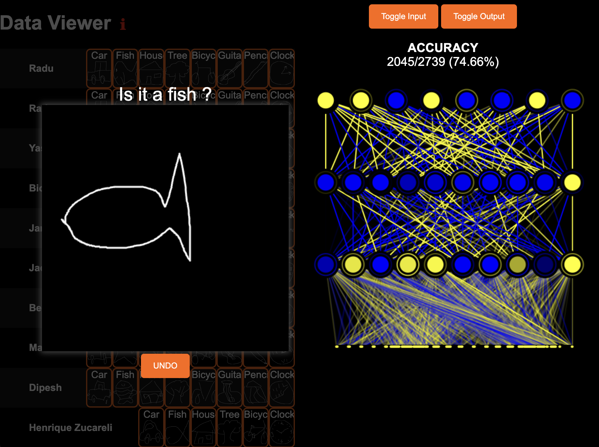

# MachineLearning\_WebApp 🎨🤖



An interactive project exploring neural network training and image classification — built step-by-step from scratch in **JavaScript**, then extended with Python evaluation.

Inspired by Dr. Radu Mariescu-Istodor’s [No Blackbox Machine Learning Course](https://www.youtube.com/watch?v=vDDjtwQDw2k).

---

## 💡 About This Project

This project guides you through collecting, processing, and classifying hand-drawn images using a custom-built multi-layer perceptron (MLP).

Starting fully in JavaScript, we implement all key ML concepts by hand, then transition to Python libraries for performance evaluation and comparison.

The project leverages a sizable labeled dataset and covers strategies for effective image classification.

---

## ⚙️ Setup & Installation

1. **Install Node.js** if not already installed:
   [https://nodejs.org/](https://nodejs.org/)

2. **Create a Python virtual environment** and install dependencies:

```bash
pip install -r requirements.txt
```

---

## 🚀 Running the Project

### 1. Generate Dataset

Run in the `/node` directory:

```bash
node dataset_generator.js
```

* Deletes any existing `/data/dataset`
* Creates `/data/models` if missing
* Processes samples into `.json` and `.img` files
* Generates `samples.json` dataset manifest

### 2. Extract Features

```bash
node feature_extractor.js
```

* Splits data into training/testing sets (configurable)
* Normalizes images
* Outputs training/testing JSON and CSV files
* Generates JS objects for shared use

### 3. Run Evaluation

In `/python` directory, run:

```bash
python mlp.py
```

Or (currently under maintenance) with Node.js:

```bash
node run_evaluation_mlp.js
```

---

## 🔍 Exploring Results

Open `viewer.html` in your browser for an interactive visualization with two modes:

* **Neural Network View:**
  See the MLP architecture and layer activations (blue = negative, yellow = positive), with predicted class probabilities.

* **Bigram View:**
  Visualize a confusion matrix showing prediction accuracy across classes.

---

## ✏️ Drawing Mode

Toggle the input canvas and draw your own images. The system will classify your drawing and display the top prediction in real-time.

---

## 🙏 Acknowledgements

Thanks to Dr. Radu Mariescu-Istodor for the inspiring tutorial series that this project builds upon.


